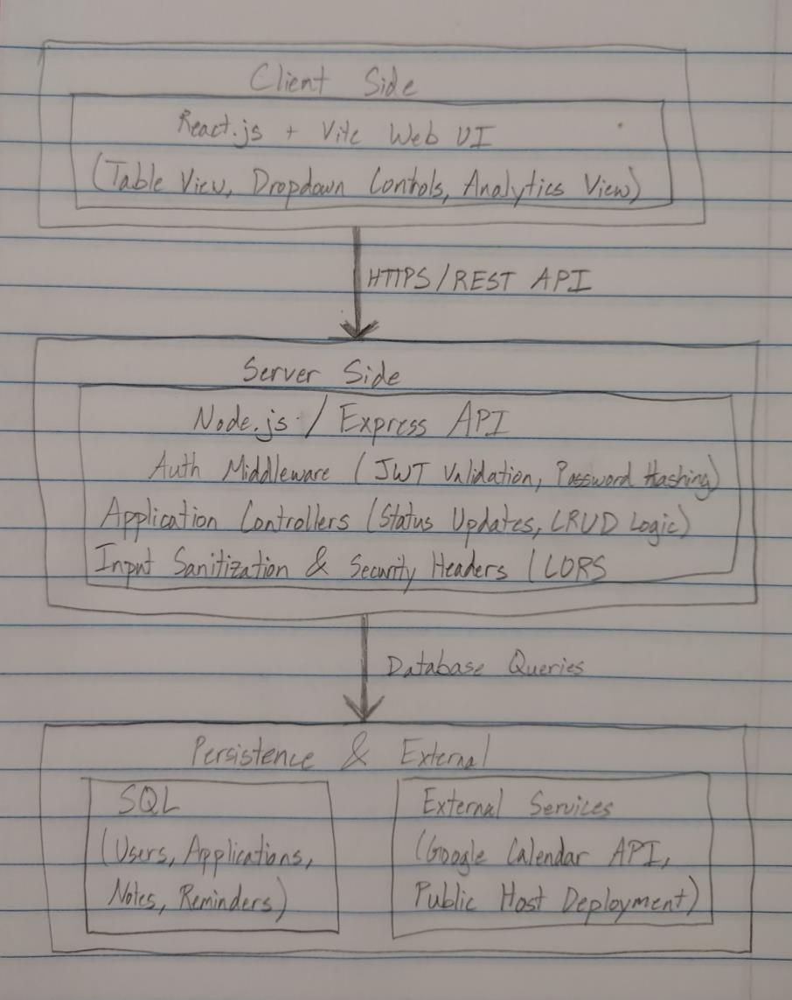

# JobTrack

JobTrack is a web-based job and internship application management platform that helps candidates organize, track, and analyze their career search across all employment sectors. It replaces fragmented spreadsheets with a clean, list-based application status board, interview tracking, and centralized notes.

## Tech Stack

- **Frontend:** React (Vite), Tailwind CSS, Lucide Icons, TanStack Table
- **Backend:** Node.js, Express.js (REST API)
- **Database:** PostgreSQL
- **Testing:** Jest/Supertest (backend), React Testing Library (frontend)
- **Tooling:** ESLint, Docker, GitHub Actions (CI/CD)

## Getting Started

**Frontend**
```bash
cd frontend
npm install
npm run dev
```

**Backend**
```bash
cd backend
npm install
npm run dev
```

Full setup instructions (environment variables, database migrations, seed data) will be added as the MVP is built out in Milestone 1.

## Team

- Jackson Lammons: Frontend, UI/UX & Security
- James Zittlow: Backend, Database, DevOps & External Integrations

## Architecture



## Backlog

Prioritized user stories for the MVP, in build order.


### High Priority

1. **Explorer-style application list** — As a job seeker, I want to view my applications in a sortable, filterable list (status, date, company, salary), so I can quickly organize and review large volumes of application data.
2. **Secure account authentication** — As a user, I want to create a secure account (JWT-based, hashed passwords), so my personal career data stays private and accessible only to me.
3. **CRUD for job applications** — As a user, I want to create, view, edit, and delete job application entries, so I can keep my records accurate and up to date.
4. **Status management** — As a user, I want to move an application through stages (Bookmarked → Applied → Interviewing → Offer/Rejected) via a status control, so I can track where each application stands.

### Medium Priority

5. **Search and filter** — As a job seeker, I want to search and filter applications by status or company name, so I can quickly reference specific positions during calls.
6. **Application summary totals** — As a user, I want to see aggregate stats (Total Applied, Pending Interviews, Offers), so I can gauge my overall progress at a glance.

### Later / Post-MVP

7. Analytics dashboard (response rates, average days per stage, offer comparisons)
8. Google Calendar API integration for interview scheduling
9. Custom tags/categories (Remote vs. On-site, Full-Time vs. Internship)

## Status

🚧 Milestone 0 — project proposed, repository initialized.

## Contributions — Milestone 0

- **Jackson Lammons:** Co-authored the project proposal (personas, MVP scope, initial requirements), set up the GitHub repository, and scaffolded the frontend project structure.
- **James Zittlow:** Co-authored the project proposal (architecture, tech stack, risk register), and will lead backend scaffolding.
