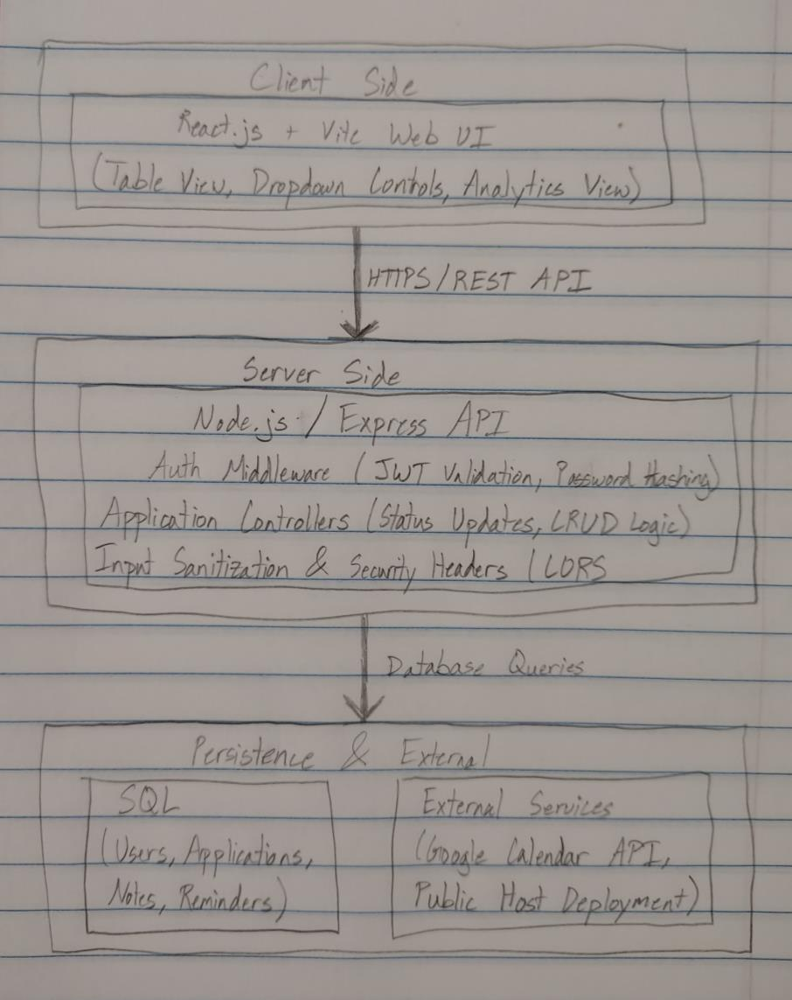

# JobTrack

JobTrack is a web-based job and internship application management platform that helps candidates organize, track, and analyze their career search across all employment sectors. It replaces fragmented spreadsheets with a clean, list-based application status board, interview tracking, and centralized notes.

## Tech Stack

- **Frontend:** React (Vite), Tailwind CSS, Lucide Icons, TanStack Table v8
- **Backend:** Node.js, Express.js (REST API)
- **Database:** PostgreSQL
- **Testing:** Jest/Supertest (backend), React Testing Library (frontend)
- **Tooling:** ESLint, Docker, GitHub Actions (CI/CD)

## Getting Started

### Prerequisites

- Node.js 22.x and npm
- PostgreSQL 18

### 1. Clone the repository

```bash
git clone https://github.com/gamerjack27/jobtrack.git
cd jobtrack
```

### 2. Backend setup

```bash
cd backend
npm install
```

Create a `.env` file in `backend/` (use `.env.example` as a starting point) with:
PORT=5000
DATABASE_URL=postgresql://<user>:<password>@localhost:5432/<database>
ACCESS_TOKEN_SECRET=<a random string>
REFRESH_TOKEN_SECRET=<a random string>

Generate random values for the two secrets with:

```bash
openssl rand -hex 32
```

Create the database:

```bash
sudo -u postgres psql -c "CREATE USER jobtrack WITH PASSWORD 'yourpassword' CREATEDB;"
sudo -u postgres psql -c "CREATE DATABASE jobtrack OWNER jobtrack;"
```

Make sure the password matches what you put in `DATABASE_URL`.

Run the migrations and generate the Prisma client:

```bash
npx prisma migrate deploy
npx prisma generate
```

Start the backend:

```bash
npm run dev
```

You should see `JobTrack API listening on port 5000`.

### 3. Frontend setup

In a separate terminal:

```bash
cd frontend
npm install
npm run dev
```

Open the printed local URL (usually `http://localhost:5173`) in a browser.

### 4. Demo account

There's no pre-seeded account. Register a new one through the app's Register screen with any email, a display name, and a password of at least 8 characters.

## Verification Steps

Use this checklist to confirm everything works end to end.

1. Register a new account. You should be logged in immediately and land on an empty application table.
2. Try registering that same email again. You should see an error saying the email is already registered.
3. Log out, then log back in with the account you just created.
4. Try logging in with the wrong password. You should see an "invalid email or password" error.
5. Click **Add Application**, fill out the form, and save. The new entry should appear in the table.
6. Click that row to open it, change a field, and save. The change should be reflected in the table.
7. Change an entry's status using its dropdown, then refresh the page and confirm it stuck.
8. Click the trash icon on a row and confirm the delete. The row should disappear and stay gone after a refresh.
9. Use the search bar to filter by company name, and click a column header to sort.

## Team

- Jackson Lammons: Frontend, UI/UX & Security
- James Zittlow: Backend, Database, DevOps & External Integrations

## Architecture



## Backlog

Prioritized user stories for the MVP, in build order.

1. Explorer-style application list
2. Secure account authentication
3. CRUD for job applications
4. Status management
5. Search and filter
6. Application summary totals
7. Analytics dashboard (post-MVP)
8. Google Calendar integration (post-MVP)
9. Custom tags/categories (post-MVP)
